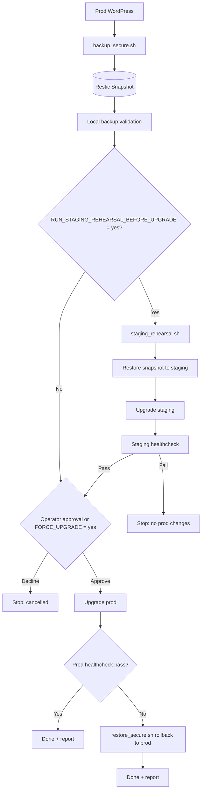

# WP Maintenance Automation

## Overview

A modern, secure WordPress site maintenance toolkit using SSH + rsync + restic. Backups are encrypted, deduplicated, and include a configurable retention policy. The toolkit also provides automated upgrades with health checks and automatic rollback, staging rehearsal before production changes, and guided restore workflows.

## Changelog

- See [CHANGELOG.md](CHANGELOG.md) for release notes.

## Pre-commit

This repository includes a pre-commit configuration tuned for the current stack (shell scripts, Dockerfile, YAML, and baseline text checks).
It also includes secret leak scanning (AWS keys, private keys, and generic secret patterns via gitleaks).

Install and enable:

```bash
pip install pre-commit
pre-commit install
```

Run against all files:

```bash
pre-commit run --all-files
```

## New: Secure Backup (`scripts/backup_secure.sh`)

Features:
- Encrypted, deduplicated backups via restic
- SSH key-based access (no plain FTP)
- Database dump performed remotely without exposing credentials on the command line
- File sync via `rsync` over SSH with cache exclusions
- Retention policy (`forget --prune`) configurable via `.env`
- Concurrency lock to prevent overlapping scheduled runs
- Backup manifest and DB checksum artifact for easier auditing
- Optional post-backup restic integrity check
- Optional: capture server configs (e.g., Nginx/Apache configs, TLS certs)
- Optional: export DNS records via a provider script (e.g., Cloudflare)

### Prerequisites
- Local: `ssh`, `rsync`, `gzip`, [`restic`](https://restic.net), `jq` installed
- Remote server: `ssh` access; optional `php` CLI for reliable `wp-config.php` parsing; `mysqldump`
- Configure a restic repository (local disk, SFTP, Backblaze B2, S3, etc.)

### Setup
1. Copy `.env.example` to `.env` and edit values:

```bash
cp .env.example .env
```

Required keys:
- `WP_SSH_HOST` (e.g., `example.com`)
- `WP_SSH_USER` (e.g., `ubuntu`)
- `WP_ROOT` (e.g., `/var/www/html`)
- `RESTIC_REPOSITORY` (e.g., `b2:bucket:wp-restic` or path)
- `RESTIC_PASSWORD_FILE` (path to a local file containing the restic repo password)

2. Create the restic password file securely:

```bash
mkdir -p "$HOME/.config/restic"
echo "your_secure_password_here" > "$HOME/.config/restic/wp_repo_password"
chmod 600 "$HOME/.config/restic/wp_repo_password"
```

3. Initialize restic repo if new:

```bash
export RESTIC_PASSWORD_FILE=$HOME/.config/restic/wp_repo_password
restic --repo /path/to/restic-repo init
```

### Run a Backup

```bash
bash scripts/backup_secure.sh
```

Artifacts are stored in `backup_artifacts/<timestamp>` by default.
You can set a dedicated directory in `.env` using `BACKUP_DIR` (e.g., `./var/backups/wp`).

### Restore Basics

List snapshots:

```bash
restic --repo "$RESTIC_REPOSITORY" snapshots
```

Restore files from a snapshot (example):

```bash
restic --repo "$RESTIC_REPOSITORY" restore latest --target ./restore
```

### Guided Restore (`scripts/restore_secure.sh`)

This script performs a safe local extract and can optionally apply changes to the remote server.

Local extract only:

```bash
bash scripts/restore_secure.sh latest
```

Remote apply (requires `CONFIRM_RESTORE=yes` in environment):

```bash
# Import DB
CONFIRM_RESTORE=yes APPLY_DB=yes bash scripts/restore_secure.sh latest

# Sync files (WARNING: DELETE_REMOTE_FILES=yes removes remote files not in the backup)
CONFIRM_RESTORE=yes APPLY_FILES=yes DELETE_REMOTE_FILES=no bash scripts/restore_secure.sh latest

# Restore server configs (with sudo on remote)
CONFIRM_RESTORE=yes APPLY_CONFIGS=yes REMOTE_SUDO=yes bash scripts/restore_secure.sh latest
```

The script reads DB credentials from the remote `wp-config.php` and imports the most recent dump found in the restored artifacts.

### Scheduling

On macOS, use `launchd` or `cron` to run `backup_secure.sh` on a schedule. Ensure your SSH key is loaded and the restic password file is accessible.

### Storage Backends

Restic supports multiple encrypted backends. Choose one and set `RESTIC_REPOSITORY` in `.env`.

- Backblaze B2:

```bash
export B2_ACCOUNT_ID=xxxxxxxx
export B2_ACCOUNT_KEY=yyyyyyyy
# .env: RESTIC_REPOSITORY=b2:my-bucket:wp-restic
```

- S3-compatible (AWS S3, Wasabi, Cloudflare R2):

```bash
export AWS_ACCESS_KEY_ID=xxxxxxxx
export AWS_SECRET_ACCESS_KEY=yyyyyyyy
# AWS S3:
# .env: RESTIC_REPOSITORY=s3:s3.amazonaws.com/my-bucket
# Wasabi:
# .env: RESTIC_REPOSITORY=s3:https://s3.eu-central-1.wasabisys.com/my-bucket
# Cloudflare R2:
# .env: RESTIC_REPOSITORY=s3:https://<account-id>.r2.cloudflarestorage.com/my-bucket
```

- SFTP:

```bash
# .env: RESTIC_REPOSITORY=sftp:user@example.com:/srv/restic/wp
```

- SMB (Samba) share:

On macOS, mount the share, then point `RESTIC_REPOSITORY` to the mounted path.

```bash
# Create a mount point
mkdir -p /Volumes/BackupShare
# Mount (will prompt for password securely)
mount_smbfs //user@server/share /Volumes/BackupShare
# .env: RESTIC_REPOSITORY=/Volumes/BackupShare/wp-restic
```

Avoid passing passwords on the command line. Prefer interactive mounting, Kerberos/SSO, or keychain-backed authentication. On Linux, use a credentials file (chmod 600) with `mount -t cifs -o credentials=/path/creds`.

- rclone:

You can integrate rclone in two secure ways:

1) Serve a restic repository over HTTP using rclone and point restic to it:

```bash
# Configure rclone remote first
rclone config
# Example: serve restic on localhost, protecting with basic auth
rclone serve restic remote:path --addr :8080 --user myuser --pass mypass
# .env: RESTIC_REPOSITORY=rest:http://localhost:8080
```

2) Mount the remote with rclone and use a local path:

```bash
# Mount remote to a local directory
mkdir -p /Volumes/ResticRepo
rclone mount remote:path /Volumes/ResticRepo &
# .env: RESTIC_REPOSITORY=/Volumes/ResticRepo
```

Note: `RESTIC_PASSWORD_FILE` is still required; restic’s encryption is independent of the transport.

### Coverage
- Database: `mysqldump` streamed over SSH and compressed.
- Site files: full mirror of `WP_ROOT` via `rsync`.
- Server configs (optional): set `SERVER_CONFIG_PATHS` in `.env` to copy directories like `/etc/nginx`, `/etc/apache2`, `/etc/letsencrypt`.
- DNS (optional): set `DNS_BACKUP_SCRIPT` to a local exporter. Example Cloudflare helper: [scripts/dns_export_cloudflare.sh](scripts/dns_export_cloudflare.sh) (requires `CLOUDFLARE_API_TOKEN` and `CLOUDFLARE_ZONE_ID`).
- Version capture: the backup manifest records `wp_version` and `db_version` for compatibility tracking and local restoration matching the exact source environment.

### Automated Upgrade + Rollback (`scripts/upgrade_with_rollback.sh`)

This script is designed for scheduled maintenance windows and executes:

1. Secure backup (`scripts/backup_secure.sh`)
2. Local backup validation (restore extract + artifact integrity checks)
3. Optional staging rehearsal gate (`scripts/staging_rehearsal.sh`) using the same snapshot
4. Operator approval prompt before upgrade (or forced with `FORCE_UPGRADE=yes`)
5. Full WordPress update via WP-CLI (`core`, `plugins`, `themes`, languages, DB upgrade)
6. Healthcheck (`curl` HTTP status check, optional extra remote smoke command)
7. Automatic rollback (`scripts/restore_secure.sh`) if update or healthcheck fails
8. Full run report with statuses for all steps



When `RUN_STAGING_REHEARSAL_BEFORE_UPGRADE=yes`, the production workflow hard-stops unless `STAGING_WP_SSH_HOST`, `STAGING_WP_SSH_USER`, and `STAGING_WP_ROOT` are set.

### Staging Rehearsal (`scripts/staging_rehearsal.sh`)

This script restores a snapshot to staging, upgrades staging, and runs health checks there.

```bash
bash scripts/staging_rehearsal.sh latest
```

Typical use with production workflow:
- Set `RUN_STAGING_REHEARSAL_BEFORE_UPGRADE=yes` in `.env`
- Configure staging target variables (`STAGING_WP_SSH_HOST`, `STAGING_WP_SSH_USER`, `STAGING_WP_ROOT`)
- Set `STAGING_HEALTHCHECK_URL`
- Run `scripts/upgrade_with_rollback.sh`

### Running `upgrade_with_rollback.sh`

```bash
bash scripts/upgrade_with_rollback.sh
```

Report output:
- Summary report: `var/reports/wp_upgrade/<timestamp>/report.txt`
- Detailed log: `var/reports/wp_upgrade/<timestamp>/run.log`

Important `.env` options:
- `HEALTHCHECK_URL` (optional, auto-detected via `wp option get home` if unset)
- `HEALTHCHECK_EXPECT_CODE` (default `200`)
- `HEALTHCHECK_RETRIES` (default `5`)
- `VALIDATE_BACKUP_BEFORE_UPGRADE` (`yes`/`no`)
- `RUN_STAGING_REHEARSAL_BEFORE_UPGRADE` (`yes`/`no`)
- `ASK_CONFIRM_BEFORE_UPGRADE` (`yes`/`no`)
- `FORCE_UPGRADE` (`yes`/`no`) for non-interactive scheduled runs
- `AUTO_RESTORE_ON_FAILURE` (`yes`/`no`)
- `APPLY_CONFIGS_ON_ROLLBACK` (`yes`/`no`)
- `UPGRADE_REPORT_DIR` (default `./var/reports/wp_upgrade`)

Backup hardening options in `.env`:
- `LOCK_DIR` to serialize backups and avoid concurrent run corruption
- `RESTIC_CHECK_AFTER_BACKUP=yes` to run `restic check` automatically
- `RESTIC_CHECK_READ_DATA_SUBSET` (for example `1/50`) for faster integrity checks

Scheduling example (cron):

```bash
0 3 * * 0 cd /path/to/backupWordPress && RUN_STAGING_REHEARSAL_BEFORE_UPGRADE=yes FORCE_UPGRADE=yes bash scripts/upgrade_with_rollback.sh
```

If your remote WP-CLI needs root permissions, set:

```bash
WP_CLI_EXTRA_ARGS=--allow-root
```

This ensures you can reconstruct the application (files + DB), web server configs, TLS certs, and DNS records.

### Local Artifacts Cleanup

The `backup_artifacts` directory accumulates timestamped backup directories. Clean them up with:

```bash
task artifacts:cleanup              # remove dirs older than 30 days
task artifacts:cleanup KEEP=7       # keep only the last 7 days
task artifacts:cleanup KEEP=0       # remove ALL local artifacts (with 3s grace period)
```

The restic repository itself is managed separately via the retention policy set in `.env`.

### Docker / NAS

You can build a container to run the backup on a NAS or any Docker host. The container includes `ssh`, `rsync`, `gzip`, `restic`, `jq`, and other required tools.

Build:

```bash
docker build -t wp-backup .
```

Run (one-shot backup):

```bash
docker run --rm \
	-v $HOME/.ssh:/root/.ssh:ro \            # SSH key & known_hosts
	-v /path/to/.env:/app/.env:ro \           # configuration
	-v /path/to/restic_pass:/app/restic_pass:ro \ # restic password file
	-e RESTIC_PASSWORD_FILE=/app/restic_pass \    # point to the mounted password file
	-v /path/to/artifacts:/app/backup_artifacts \ # local artifacts directory
	-v /path/to/restic_repo:/restic_repo \    # optional if using a local restic repo
	wp-backup
```

Notes:
- SSH: mount your private key and `known_hosts` in `/root/.ssh`; ensure permissions are 600 on the host.
- restic backends: for B2/S3, pass envs like `AWS_ACCESS_KEY_ID`, `AWS_SECRET_ACCESS_KEY`, or `B2_ACCOUNT_ID`, `B2_ACCOUNT_KEY` to `docker run`.
- Scheduling: run the container on a cron/scheduler provided by your NAS. The image runs one backup per container start.
- Custom commands: `docker run --rm wp-backup bash scripts/restore_secure.sh latest` will execute restore instead of backup.

Synology helper:
- See [scripts/synology_run_example.sh](scripts/synology_run_example.sh) for a Task Scheduler-friendly `docker run` example with the required mounts.

## History

This project originally contained a quick FTP-based script to back up a WordPress site to a Time Capsule. The FTP-based script was removed due to security issues:
- FTP sends credentials and data in clear
- Secrets were hardcoded and passed via command line
- OS/tooling mismatch and logic errors

The current toolkit replaces that approach with SSH + rsync + restic for encrypted, secure backups and maintenance workflows.

## CI / Automation

The Docker-based tasks (`task build`, `task backup`, `task upgrade`, `task test`, `task test:visual`) are designed for CI pipelines.

### Non-Interactive Upgrade

In CI, skip the operator prompt with `ASK_CONFIRM_BEFORE_UPGRADE=no`:

```bash
ASK_CONFIRM_BEFORE_UPGRADE=no task upgrade
```

> **TTY note**: The `task` commands use `docker run -it` for real-time progress output. In CI (no TTY), use `-i` instead and pipe the SSH key through stdin:
> ```bash
> ASK_CONFIRM_BEFORE_UPGRADE=no docker run --rm -i \
>   -v "$PWD/.env:/app/.env:ro" \
>   -v "$HOME/.config/restic/wp_repo_password:/app/restic_pass:ro" \
>   -e RESTIC_PASSWORD_FILE=/app/restic_pass \
>   -v "$PWD/backup_artifacts:/app/backup_artifacts" \
>   -v "$PWD/var:/app/var" \
>   -v "$PWD/scripts:/app/scripts:ro" \
>   wp-backup bash -c 'cat > /root/.ssh/id_rsa && chmod 600 /root/.ssh/id_rsa && exec /app/scripts/upgrade_with_rollback.sh' < ~/.ssh/id_ed25519
> ```

Available CI-friendly env vars (see `scripts/upgrade_with_rollback.sh` for defaults):

| Variable | Default | CI recommendation |
|---|---|---|
| `ASK_CONFIRM_BEFORE_UPGRADE` | `yes` | `no` |
| `VALIDATE_BACKUP_BEFORE_UPGRADE` | `yes` | `yes` (keep safety) |
| `RUN_STAGING_REHEARSAL_BEFORE_UPGRADE` | `no` | `no` (or `yes` if you have a staging target) |
| `AUTO_RESTORE_ON_FAILURE` | `yes` | `yes` (auto rollback) |
| `FORCE_UPGRADE` | `no` | `no` |

Scheduling example (cron / CI scheduler):

```bash
0 3 * * 0 cd /path/to/repo && RUN_STAGING_REHEARSAL_BEFORE_UPGRADE=yes FORCE_UPGRADE=yes bash scripts/upgrade_with_rollback.sh
```

### CI Pipeline Test

Run the full end-to-end test suite:

```bash
task test
```

Or a visual restore + upgrade check:

```bash
task test:visual SNAPSHOT=latest
```

Both tasks exit non-zero on failure, suitable for CI gating.

## Testing

An end-to-end test suite is available in `tests/` to validate backup, upgrade, and restore in a Docker-based environment.

### Overview

The suite creates three containers:

- **db** — MariaDB with the WordPress database
- **wp-site** — WordPress at a pinned initial version with SSH access (simulates the remote production server)
- **test-runner** — Runs the test script; has `rsync`, `restic`, `openssh-client` and mounts the project scripts

### Test Phases

| Phase | Description |
|---|---|
| 0 — Environment Setup | SSH connectivity, restic init, WordPress install, create test posts/pages, install plugin + theme |
| 1 — Backup | `backup_secure.sh` runs (DB dump + rsync + restic) at initial WP version |
| 2 — Upgrade | `wp core update` to target version, update plugins/themes/DB |
| 3 — Post-Upgrade Verify | Check posts/pages/content preserved after upgrade |
| 4 — Restore | `restore_secure.sh` local extract + remote apply from the backup snapshot |
| 5 — Post-Restore Verify | Check WP version rolled back, posts/pages/content intact |

### Prerequisites

- Docker (Compose v2). On macOS, [colima](https://github.com/abiosoft/colima) or Docker Desktop.

### Running

```bash
cd tests
make test
```

This generates SSH keys if missing, builds the container images, and runs the full test suite. A clean exit means all phases passed.

When run from backup artifacts directory, the Makefile auto-detects:
- `WP_INITIAL_VERSION` from the latest backup's `wp-includes/version.php`
- `WP_UPGRADE_VERSION` from the WordPress API
- `WP_PHP_VERSION` from `../.env`

You can override any of these explicitly:

```bash
make test WP_INITIAL_VERSION=6.6.2 WP_UPGRADE_VERSION=6.7.2 WP_PHP_VERSION=8.1
```

### Cleaning Up

```bash
make clean
```

Stops all containers, removes volumes, and deletes the generated SSH keys.

### Visual Test Environment

Spin up a local WordPress instance from a restic snapshot for manual inspection, then upgrades it to the latest version:

```bash
task test:visual SNAPSHOT=latest
```

The task:
1. Extracts the snapshot and reads `wp_version`, `db_version`, `DB_NAME`, `DB_USER` from the backup
2. Launches matching Docker images (MariaDB + custom Debian WordPress image)
3. Creates the database user matching the backup's credentials
4. Imports the database dump with matching table prefix
5. Copies the WordPress files
6. Enables HTTPS with a self-signed certificate
7. **Upgrades** WordPress core, plugins, and themes to the latest versions
8. Opens a browsable WordPress at `https://localhost:8443` (accept the self-signed cert warning)

Press Ctrl+C to stop and clean up.

Override the target upgrade version:

```bash
task test:visual SNAPSHOT=latest WP_UPGRADE_VERSION=6.7.2
```

## Notes

- Store secrets outside of the repo (e.g., `.env`, `RESTIC_PASSWORD_FILE`), and do not commit them.
- Consider server-side backups with restic or borg, pushing to a remote repository, to minimize data pulled over SSH.
- The repo includes a `.gitignore` to keep `.env` and generated artifacts (`backup_artifacts/`, `var/`, `restore/`) out of version control.
